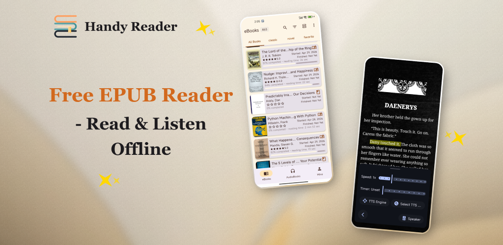

<p align="center">
  
</p>

<p align="center" dir="rtl">
  <em>اقرأ بحرية، واستمع بلا حدود.</em>
</p>

<p align="center">
  <a href="../README.md">English</a> | <a href="README.zh.md">中文</a> | <a href="README.fr.md">Français</a> | <a href="README.de.md">Deutsch</a> | <a href="README.es.md">Español</a> | <a href="README.pt.md">Português</a> | <a href="README.ru.md">Русский</a> | <a href="README.hi.md">हिन्दी</a> | <a href="README.ja.md">日本語</a> | <strong>العربية</strong>
</p>

<p align="center">
  <a href="https://www.gnu.org/licenses/gpl-3.0.en.html"></a>
  
  
  <a href="https://handyreader.top/download.html"></a>
</p>

<p align="center">
  <a href="https://play.google.com/store/apps/details?id=com.wxn.reader"><strong>احصل عليه من Google Play</strong></a>
  &nbsp;·&nbsp;
  <a href="https://handyreader.top/download.html"><strong>تنزيل APK</strong></a>
  &nbsp;·&nbsp;
  <a href="https://github.com/EucWang/HandyReader/releases"><strong>GitHub Releases</strong></a>
</p>

---

<p align="center" dir="rtl">
HandyReader هو قارئ كتب إلكترونية وكتب صوتية مجاني ومفتوح المصدر لنظام أندرويد. يدعم مجموعة واسعة من الصيغ، ويتميز بمحرك تحويل النص إلى كلام بالذكاء الاصطناعي العصبي يعمل دون اتصال، وتخصيص عميق وفق Material You، مع الاحتفاظ بجميع بياناتك على جهازك.
</p>

## لقطات الشاشة

<table>
  <tr>
    <td width="25%" align="center"></td>
    <td width="25%" align="center"></td>
    <td width="25%" align="center"></td>
    <td width="25%" align="center"></td>
  </tr>
  <tr>
    <td align="center"><sub>المكتبة</sub></td>
    <td align="center"><sub>القراءة</sub></td>
    <td align="center"><sub>التظليل والملاحظات</sub></td>
    <td align="center"><sub>تحويل النص إلى كلام</sub></td>
  </tr>
</table>

## الميزات

### 📚 قارئ متعدد الصيغ
اقرأ الكتب الإلكترونية واستمع إلى الكتب الصوتية في تطبيق واحد.
- **الكتب الإلكترونية**: EPUB، MOBI، AZW، AZW3، FB2، TXT، Markdown، HTML، PDF
- **الكتب الصوتية**: MP3، M4A، AAC (مدعومة بـ Media3/ExoPlayer)
- محرك تحليل أصلي بلغة C++‎ (libmobi، libxml2، CSSParser) للسرعة والدقة العالية

### 🎯 تحويل النص إلى كلام بالذكاء الاصطناعي دون اتصال
الميزة الأبرز. استمع إلى أي كتاب بأصوات طبيعية تعتمد على الشبكات العصبية — **يعمل بالكامل دون اتصال، دون الحاجة إلى الإنترنت**.
- ثلاثة محركات: **الذكاء الاصطناعي العصبي دون اتصال** (sherpa-onnx)، **Edge TTS** (عبر الإنترنت)، **نظام TTS** (احتياطي)
- التشغيل في الخلفية مع عناصر تحكم عبر الإشعارات
- سرعة ونبرة قابلة للتعديل، مؤقت النوم، تخطي الفصول
- نماذج أصوات قابلة للتنزيل بلغات متعددة

### 🎨 تصميم Material You وتخصيص عميق
- ألوان ديناميكية على أندرويد 12+‎ (تخصيص السمة بناءً على خلفية Material You)
- 12 نظام ألوان، 11 سمة قراءة
- خلفيات قراءة مخصصة (ألوان صلبة أو صور من المعرض)
- ثلاثة مصادر للخطوط: خطوط النظام، أو خطوط الكتالوج القابلة للتنزيل، أو استيراد خطوطك الخاصة

### 📝 التعليقات التوضيحية والملاحظات
- تظليل وتسطير وملاحظات بألوان مخصصة
- البحث داخل الكتاب وتصفية التعليقات التوضيحية
- متصفح مخصص للملاحظات

### 📖 كتالوجات OPDS عبر الإنترنت
- تصفّح وحمّل الكتب من كتالوجات OPDS 1.x عبر الإنترنت
- دعم المصادقة (اسم المستخدم/كلمة المرور)
- كتالوجات عامة مدمجة + أضف كتالوجاتك الخاصة

### 🃏 بطاقات الاقتباس
أنشئ بطاقات اقتباس جميلة وقابلة للمشاركة من النص المحدد.
- 5 أنماط: أبيض بسيط، ليل داكن، رق الكتاب، ملصق الغلاف، اقتباس كبير
- 4 نسب أبعاد (3:4، 1:1، 9:16، 4:5)
- احفظ في المعرض أو شارك مباشرة

### 📊 إحصائيات القراءة
- وقت القراءة اليومي والإجمالي ولكل كتاب
- سلاسل القراءة (الحالية والأطول)
- خريطة حرارية لعادات القراءة
- تتبع التقدم (لم يبدأ / قيد القراءة / مكتمل)

### 🗂️ مكتبة ذكية
- أرفف غير محدودة
- تخطيطات شبكية وقائمة
- التصفية حسب الحالة أو نوع الملف أو آخر فتح أو العنوان أو التقدم
- ترتيب وتنظيم المجموعات الكبيرة

### 🔤 القاموس والترجمة
- قاموس مدمج (WordNet، ECDICT، والمزيد)
- ترجمة بالذكاء الاصطناعي عبر الإنترنت (نموذج Meta m2/m100)
- سجل البحث
- التكامل مع تطبيقات القواميس الخارجية

### 🔒 الخصوصية أولاً
- جميع البيانات مخزنة محلياً على جهازك
- بدون تحليلات أو تتبع من أي طرف ثالث
- مفتوح المصدر بالكامل بموجب GPLv3

### 💾 النسخ الاحتياطي والاستعادة
- تصدير/استيراد بيانات القراءة (ZIP)
- يشمل التقدم والتعليقات التوضيحية والملاحظات والإشارات المرجعية والأرفف والإحصائيات والتفضيلات
- دمج ذكي عبر الأجهزة يعتمد على تجزئة المحتوى

## لماذا HandyReader؟

| | HandyReader | القراء الآخرون |
|---|:---:|:---:|
| **تحويل النص إلى كلام بالذكاء الاصطناعي دون اتصال** | ✅ أصوات عصبية، دون إنترنت | ❌ نظام TTS فقط |
| **دعم الكتب الصوتية** | ✅ MP3/M4A/AAC | ❌ كتب إلكترونية فقط |
| **تغطية الصيغ** | ✅ أكثر من 12 صيغة | ⚠️ عادةً 3–5 |
| **عمق التخصيص** | ✅ السمات والخطوط والخلفيات والتخطيطات | ⚠️ محدود |
| **مفتوح المصدر** | ✅ GPLv3 | ⚠️ غالباً مغلق |
| **بطاقات الاقتباس** | ✅ مدمجة | ❌ نادر |

## البدء

**المتطلبات**: أندرويد 6.0 (API 23) أو أحدث.

1. **Google Play** (موصى به للتحديثات التلقائية): [تثبيت HandyReader](https://play.google.com/store/apps/details?id=com.wxn.reader)
2. **تنزيل APK** (يدعم الأجهزة بدون خدمات Google): [التنزيل من handyreader.top](https://handyreader.top/download.html)
3. **GitHub Releases** (تصفّح جميع الإصدارات): [Releases](https://github.com/EucWang/HandyReader/releases)

افتح كتاباً من جهازك أو استورد واحداً — سيتعامل HandyReader مع ملفات EPUB وMOBI وAZW3 وFB2 وTXT وMD وHTML وPDF والكتب الصوتية. يمكنك أيضاً فتح الملفات المرسلة من تطبيقات أخرى.

## قريباً

- 🔄 مزامنة تقدم القراءة عبر WebDAV
- 📡 دعم OPDS 2.0
- 📚 دعم صيغة الكوميك CBR/CBZ
- 🎧 صيغة الكتاب الصوتي M4B مع دعم الفصول
- 🎙️ أصوات Edge TTS عبر الإنترنت
- 📄 تحسين تحليل PDF / Markdown / HTML

> يتم تطوير المشروع بشكل نشط. تحقق من [Releases](https://github.com/EucWang/HandyReader/releases) لمعرفة أحدث التغييرات.

## التقنيات المستخدمة

| الفئة | التقنية |
|---|---|
| **واجهة المستخدم** | Jetpack Compose, Material Design 3, Navigation Compose |
| **حقن التبعيات** | Hilt (Dagger) |
| **قاعدة البيانات** | Room |
| **التفضيلات** | DataStore |
| **العمليات غير المتزامنة** | Coroutines & Flow |
| **تحميل الصور** | Coil 3 |
| **تشغيل الوسائط** | Media3 / ExoPlayer |
| **تحويل النص إلى كلام** | sherpa-onnx (عصبي دون اتصال), Edge TTS, Android TTS |
| **التحليل** | libmobi (C++/JNI), jsoup, CSSParser |
| **الشبكات** | Ktor, OkHttp |

## البناء من المصدر

يتطلب هذا المشروع **Android Studio Ladybug** (أو أحدث)، و**JDK 17**، و**Android NDK**.

```bash
git clone https://github.com/EucWang/HandyReader.git
cd HandyReader
./gradlew :app:assembleDebug
```

> **ملاحظة**: تتطلب الوحدات الأصلية (`mobi` و`jp2forandroid` و`text2speech`) NDK للترجمة. يمكنك البناء على Windows أو macOS أو Linux — راجع وثائق المشروع للتفاصيل.

<details>
<summary>متغيرات البناء</summary>

- `assembleDebug` — APK للتصحيح لأغراض التطوير
- `assembleRelease` — APK للإصدار (يتطلب تكوين التوقيع في `key.properties`)
- `bundleRelease` — حزمة AAB للإصدار على Google Play

</details>

## الترخيص

[](https://www.gnu.org/licenses/gpl-3.0.en.html)

هذا المشروع مرخص بموجب **رخصة GNU General Public License v3.0** — راجع ملف [LICENSE](../LICENSE) للتفاصيل.

## شكر وتقدير

HandyReader builds on the work of many open-source projects:

- [Skydoves](https://github.com/skydoves) — ColorPicker Compose
- [Shivamdhuria](https://github.com/Shivamdhuria) — Palette library
- [androidSpeech](https://github.com/gotev/android-speech) — Text-to-Speech
- [libmobi](https://github.com/bfabiszewski/libmobi) — MOBI/AZW library
- [tidy-html5](https://github.com/htacg/tidy-html5) — HTML tidy
- [utfcpp](https://github.com/nemtrif/utfcpp) — UTF-8 library
- [CSSParser](https://github.com/luojilab/CSSParser) — CSS parser
- [minizip](http://www.winimage.com/zLibDll/minizip.html) — ZIP library
- [jp2ForAndroid](https://github.com/EucWang/jp2ForAndroid) — JPEG2000 decoder
- [libxml2](https://gitlab.gnome.org/GNOME/libxml2) — XML parser
- [sherpa-onnx](https://github.com/k2-fsa/sherpa-onnx) — Offline neural TTS engine
