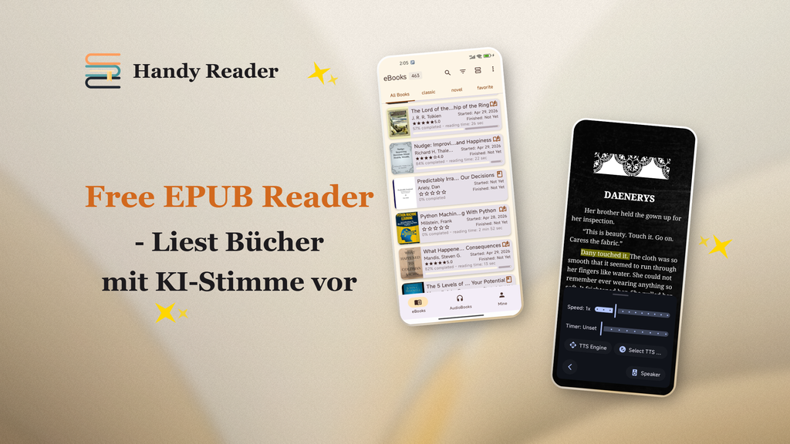

<p align="center">
  
</p>

<p align="center">
  <em>„Frei lesen, endlos zuhören."</em>
</p>

<p align="center">
  <a href="../README.md">English</a> | <a href="README.zh.md">中文</a> | <a href="README.fr.md">Français</a> | <strong>Deutsch</strong> | <a href="README.es.md">Español</a> | <a href="README.pt.md">Português</a> | <a href="README.ru.md">Русский</a> | <a href="README.hi.md">हिन्दी</a> | <a href="README.ja.md">日本語</a> | <a href="README.ar.md">العربية</a>
</p>

<p align="center">
  <a href="https://www.gnu.org/licenses/gpl-3.0.en.html"></a>
  
  
  <a href="https://handyreader.top/download.html"></a>
</p>

<p align="center">
  <a href="https://play.google.com/store/apps/details?id=com.wxn.reader"><strong>Bei Google Play erhältlich</strong></a>
  &nbsp;·&nbsp;
  <a href="https://handyreader.top/download.html"><strong>APK herunterladen</strong></a>
  &nbsp;·&nbsp;
  <a href="https://github.com/EucWang/HandyReader/releases"><strong>GitHub-Releases</strong></a>
</p>

---

HandyReader ist ein kostenloser, quelloffener E-Book- und Hörbuch-Reader für Android. Er unterstützt eine Vielzahl von Formaten, bietet eine Offline-Neuronale-KI-Sprachsynthese-Engine, eine tiefgreifende Material-You-Anpassung und speichert alle deine Daten auf deinem Gerät.

## Screenshots

<table>
  <tr>
    <td width="25%" align="center"></td>
    <td width="25%" align="center"></td>
    <td width="25%" align="center"></td>
    <td width="25%" align="center"></td>
  </tr>
  <tr>
    <td align="center"><sub>Bibliothek</sub></td>
    <td align="center"><sub>Lesen</sub></td>
    <td align="center"><sub>Hervorhebungen und Notizen</sub></td>
    <td align="center"><sub>Text-zu-Sprache</sub></td>
  </tr>
</table>

## Funktionen

### 📚 Multi-Format-Reader
Lies E-Books und höre Hörbücher in einer einzigen App.
- **E-Books**: EPUB, MOBI, AZW, AZW3, FB2, TXT, Markdown, HTML, PDF
- **Hörbücher**: MP3, M4A, AAC (angetrieben von Media3/ExoPlayer)
- Native C++-Parser-Engine (libmobi, libxml2, CSSParser) für Geschwindigkeit und Detailtreue

### 🎯 Offline-KI-Text-zu-Sprache
Das Highlight. Höre dir jedes Buch mit natürlichen neuronalen Stimmen an — **komplett offline, keine Internetverbindung erforderlich**.
- Drei Engines: **Offline-Neuronale KI** (sherpa-onnx), **Edge TTS** (online), **System-TTS** (Fallback)
- Hintergrundwiedergabe mit Steuerung über Benachrichtigungen
- Geschwindigkeit und Tonhöhe einstellbar, Schlaf-Timer, Kapitelsprung
- Herunterladbare Sprachmodelle für mehrere Sprachen

### 🎨 Material-You-Design und tiefgreifende Anpassung
- Dynamische Farben auf Android 12+ (Material-You-Design basierend auf dem Hintergrundbild)
- 12 Farbschemata, 11 Lesethemen
- Benutzerdefinierte Leserückgründe (einfarbige Farben oder Galeriebilder)
- Drei Schriftart-Quellen: Systemschriftarten, aus dem Katalog herunterladbare Schriftarten oder eigene importieren

### 📝 Annotationen und Notizen
- Hervorhebungen, Unterstreichungen und Notizen mit benutzerdefinierten Farben
- Buchinterne Suche und Annotationsfilter
- Eigener Notiz-Browser

### 📖 OPDS-Online-Kataloge
- Durchsuche und lade Bücher aus OPDS-1.x-Online-Katalogen herunter
- Authentifizierungsunterstützung (Benutzername/Passwort)
- Eingebaute öffentliche Kataloge + eigene hinzufügen

### 🃏 Zitatkarten
Erstelle wunderschöne, teilbare Zitatkarten aus markiertem Text.
- 5 Stile: Minimal Weiß, Dunkle Nacht, Pergament, Cover-Poster, Großes Zitat
- 4 Seitenverhältnisse (3:4, 1:1, 9:16, 4:5)
- In der Galerie speichern oder direkt teilen

### 📊 Lese-Statistiken
- Tägliche, gesamte und buchbezogene Lesezeit
- Leseserien (aktuell und längste)
- Heatmap der Lesegewohnheiten
- Fortschrittsverfolgung (nicht begonnen / in Bearbeitung / abgeschlossen)

### 🗂️ Intelligente Bibliothek
- Unbegrenzte Regale
- Raster- und Listen-Layouts
- Filtern nach Status, Dateityp, zuletzt geöffnet, Titel oder Fortschritt
- Große Sammlungen sortieren und organisieren

### 🔤 Wörterbuch und Übersetzung
- Eingebautes Wörterbuch (WordNet, ECDICT und mehr)
- Online-KI-Übersetzung (Meta m2/m100-Modell)
- Suchverlauf
- Integration in externe Wörterbuch-Apps

### 🔒 Datenschutz zuerst
- Alle Daten werden lokal auf deinem Gerät gespeichert
- Keine Drittanbieter-Analytics oder Tracking
- Vollständig quelloffen unter GPLv3

### 💾 Backup und Wiederherstellung
- Export/Import deiner Lesedaten (ZIP)
- Umfasst Fortschritt, Annotationen, Notizen, Lesezeichen, Regale, Statistiken und Einstellungen
- Inhalts-Hash-basiertes intelligentes Zusammenführen geräteübergreifend

## Warum HandyReader?

| | HandyReader | Typische Reader |
|---|:---:|:---:|
| **Offline-KI-TTS** | ✅ Neuronale Stimmen, kein Internet | ❌ Nur System-TTS |
| **Hörbuch-Unterstützung** | ✅ MP3/M4A/AAC | ❌ Nur E-Books |
| **Formatabdeckung** | ✅ 12+ Formate | ⚠️ Meistens 3-5 |
| **Anpassungstiefe** | ✅ Themen, Schriftarten, Hintergründe, Layouts | ⚠️ Eingeschränkt |
| **Quelloffen** | ✅ GPLv3 | ⚠️ Oft geschlossen |
| **Zitatkarten** | ✅ Eingebaut | ❌ Selten |

## Erste Schritte

**Voraussetzungen**: Android 6.0 (API 23) oder höher.

1. **Google Play** (empfohlen für automatische Updates): [HandyReader installieren](https://play.google.com/store/apps/details?id=com.wxn.reader)
2. **APK-Download** (Geräte ohne Google-Dienste werden unterstützt): [Von handyreader.top herunterladen](https://handyreader.top/download.html)
3. **GitHub-Releases** (alle Versionen durchsuchen): [Releases](https://github.com/EucWang/HandyReader/releases)

Öffne ein Buch von deinem Gerät oder importiere eines — HandyReader verarbeitet EPUB-, MOBI-, AZW3-, FB2-, TXT-, MD-, HTML-, PDF- und Hörbuch-Dateien. Du kannst auch Dateien öffnen, die aus anderen Apps gesendet wurden.

## Demnächst

- 🔄 WebDAV-Sync des Lesefortschritts
- 📡 OPDS-2.0-Unterstützung
- 📚 Unterstützung für CBR/CBZ-Comic-Formate
- 🎧 M4B-Hörbuchformat mit Kapitelunterstützung
- 🎙️ Online Edge-TTS-Stimmen
- 📄 Verbesserte PDF-/Markdown-/HTML-Analyse

> Das Projekt wird aktiv entwickelt. Schau in den [Releases](https://github.com/EucWang/HandyReader/releases) nach den neuesten Änderungen.

## Tech-Stack

| Kategorie | Technologie |
|---|---|
| **Benutzeroberfläche** | Jetpack Compose, Material Design 3, Navigation Compose |
| **Dependency Injection** | Hilt (Dagger) |
| **Datenbank** | Room |
| **Einstellungen** | DataStore |
| **Asynchron** | Coroutines & Flow |
| **Bilder laden** | Coil 3 |
| **Medienwiedergabe** | Media3 / ExoPlayer |
| **Text-zu-Sprache** | sherpa-onnx (offline neuronal), Edge TTS, Android TTS |
| **Parsen** | libmobi (C++/JNI), jsoup, CSSParser |
| **Netzwerk** | Ktor, OkHttp |

## Aus dem Quellcode kompilieren

Dieses Projekt erfordert **Android Studio Ladybug** (oder neuer), **JDK 17** und das **Android NDK**.

```bash
git clone https://github.com/EucWang/HandyReader.git
cd HandyReader
./gradlew :app:assembleDebug
```

> **Hinweis**: Native Module (`mobi`, `jp2forandroid`, `text2speech`) benötigen das NDK zum Kompilieren. Kompiliere unter Windows, macOS oder Linux — siehe Projektdokumentation für Details.

<details>
<summary>Build-Varianten</summary>

- `assembleDebug` — Debug-APK für die Entwicklung
- `assembleRelease` — Release-APK (erfordert Signaturkonfiguration in `key.properties`)
- `bundleRelease` — Release-AAB für Google Play

</details>

## Lizenz

[](https://www.gnu.org/licenses/gpl-3.0.en.html)

Dieses Projekt ist unter der **GNU General Public License v3.0** lizenziert — siehe die [LICENSE](../LICENSE)-Datei für Details.

## Danksagung

HandyReader baut auf der Arbeit vieler quelloffener Projekte auf:

- [Skydoves](https://github.com/skydoves) — ColorPicker Compose
- [Shivamdhuria](https://github.com/Shivamdhuria) — Palette library
- [androidSpeech](https://github.com/gotev/android-speech) — Text-to-Speech
- [libmobi](https://github.com/bfabiszewski/libmobi) — MOBI/AZW library
- [tidy-html5](https://github.com/htacg/tidy-html5) — HTML tidy
- [utfcpp](https://github.com/nemtrif/utfcpp) — UTF-8 library
- [CSSParser](https://github.com/luojilab/CSSParser) — CSS parser
- [minizip](http://www.winimage.com/zLibDll/minizip.html) — ZIP library
- [jp2ForAndroid](https://github.com/EucWang/jp2ForAndroid) — JPEG2000 decoder
- [libxml2](https://gitlab.gnome.org/GNOME/libxml2) — XML parser
- [sherpa-onnx](https://github.com/k2-fsa/sherpa-onnx) — Offline neural TTS engine
