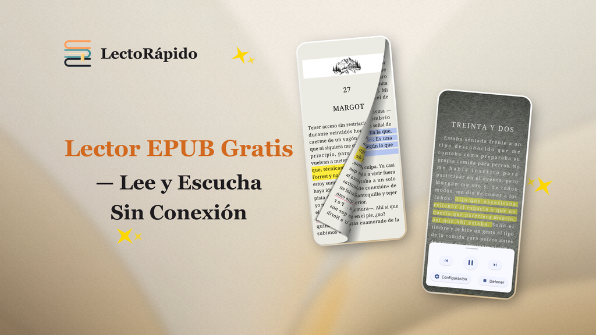

<p align="center">
  
</p>

<p align="center">
  <em>Lee libremente, escucha sin límites.</em>
</p>

<p align="center">
  <a href="../README.md">English</a> | <a href="README.zh.md">中文</a> | <a href="README.fr.md">Français</a> | <a href="README.de.md">Deutsch</a> | <strong>Español</strong> | <a href="README.pt.md">Português</a> | <a href="README.ru.md">Русский</a> | <a href="README.hi.md">हिन्दी</a> | <a href="README.ja.md">日本語</a> | <a href="README.ar.md">العربية</a>
</p>

<p align="center">
  <a href="https://www.gnu.org/licenses/gpl-3.0.en.html"></a>
  
  
  <a href="https://handyreader.top/download.html"></a>
</p>

<p align="center">
  <a href="https://play.google.com/store/apps/details?id=com.wxn.reader"><strong>Disponible en Google Play</strong></a>
  &nbsp;·&nbsp;
  <a href="https://handyreader.top/download.html"><strong>Descargar APK</strong></a>
  &nbsp;·&nbsp;
  <a href="https://github.com/EucWang/HandyReader/releases"><strong>Releases en GitHub</strong></a>
</p>

---

HandyReader es un lector de libros electrónicos y audiolibros gratuito y de código abierto para Android. Es compatible con una amplia variedad de formatos, incorpora un motor de texto a voz neuronal sin conexión, ofrece una profunda personalización con Material You y mantiene todos tus datos en tu dispositivo.

## Capturas de pantalla

<table>
  <tr>
    <td width="25%" align="center"></td>
    <td width="25%" align="center"></td>
    <td width="25%" align="center"></td>
    <td width="25%" align="center"></td>
  </tr>
  <tr>
    <td align="center"><sub>Biblioteca</sub></td>
    <td align="center"><sub>Lectura</sub></td>
    <td align="center"><sub>Resaltados y notas</sub></td>
    <td align="center"><sub>Texto a voz</sub></td>
  </tr>
</table>

## Funciones

### 📚 Lector multiformato
Lee libros electrónicos y escucha audiolibros en una sola aplicación.
- **Libros electrónicos**: EPUB, MOBI, AZW, AZW3, FB2, TXT, Markdown, HTML, PDF
- **Audiolibros**: MP3, M4A, AAC (con Media3/ExoPlayer)
- Motor de análisis nativo en C++ (libmobi, libxml2, CSSParser) para rapidez y fidelidad

### 🎯 Texto a voz con IA sin conexión
La función estrella. Escucha cualquier libro con voces neuronales naturales — **totalmente sin conexión, sin necesidad de internet**.
- Tres motores: **IA neuronal sin conexión** (sherpa-onnx), **Edge TTS** (en línea), **TTS del sistema** (alternativo)
- Reproducción en segundo plano con controles en la notificación
- Velocidad y tono ajustables, temporizador de reposo, salto entre capítulos
- Modelos de voz descargables para varios idiomas

### 🎨 Diseño Material You y personalización profunda
- Colores dinámicos en Android 12+ (tematización basada en el fondo de pantalla con Material You)
- 12 esquemas de color, 11 temas de lectura
- Fondos de lectura personalizados (colores sólidos o imágenes de la galería)
- Tres orígenes de fuentes: fuentes del sistema, fuentes descargables del catálogo o importa las tuyas

### 📝 Anotaciones y notas
- Resaltados, subrayados y notas con colores personalizados
- Búsqueda dentro del libro y filtrado de anotaciones
- Explorador de notas dedicado

### 📖 Catálogos OPDS en línea
- Explora y descarga libros de catálogos OPDS 1.x en línea
- Compatibilidad con autenticación (usuario/contraseña)
- Catálogos públicos integrados + añade los tuyos

### 🃏 Tarjetas de citas
Genera preciosas tarjetas de citas compartibles a partir del texto seleccionado.
- 5 estilos: blanco minimalista, noche oscura, pergamino, póster de portada, cita grande
- 4 relaciones de aspecto (3:4, 1:1, 9:16, 4:5)
- Guarda en la galería o comparte directamente

### 📊 Estadísticas de lectura
- Tiempo de lectura diario, total y por libro
- Rachas de lectura (actual y más larga)
- Mapa de calor de hábitos de lectura
- Seguimiento del progreso (no empezado / en curso / terminado)

### 🗂️ Biblioteca inteligente
- Estantes ilimitados
- Diseños de cuadrícula y lista
- Filtra por estado, tipo de archivo, última apertura, título o progreso
- Ordena y organiza colecciones grandes

### 🔤 Diccionario y traducción
- Diccionario integrado (WordNet, ECDICT y más)
- Traducción con IA en línea (modelo Meta m2/m100)
- Historial de búsquedas
- Integración con aplicaciones de diccionario externas

### 🔒 Privacidad ante todo
- Todos los datos se almacenan localmente en tu dispositivo
- Sin analíticas ni seguimiento de terceros
- Totalmente de código abierto bajo GPLv3

### 💾 Copia de seguridad y restauración
- Exporta/importa tus datos de lectura (ZIP)
- Incluye progreso, anotaciones, notas, marcadores, estantes, estadísticas y preferencias
- Fusión inteligente entre dispositivos basada en hash de contenido

## ¿Por qué HandyReader?

| | HandyReader | Lectores habituales |
|---|:---:|:---:|
| **TTS con IA sin conexión** | ✅ Voces neuronales, sin internet | ❌ Solo TTS del sistema |
| **Soporte de audiolibros** | ✅ MP3/M4A/AAC | ❌ Solo libros electrónicos |
| **Cobertura de formatos** | ✅ Más de 12 formatos | ⚠️ Normalmente 3-5 |
| **Profundidad de personalización** | ✅ Temas, fuentes, fondos, diseños | ⚠️ Limitada |
| **Código abierto** | ✅ GPLv3 | ⚠️ A menudo cerrado |
| **Tarjetas de citas** | ✅ Integrado | ❌ Raro |

## Primeros pasos

**Requisitos**: Android 6.0 (API 23) o superior.

1. **Google Play** (recomendado para actualizaciones automáticas): [Instalar HandyReader](https://play.google.com/store/apps/details?id=com.wxn.reader)
2. **Descarga de APK** (compatible con dispositivos sin servicios de Google): [Descargar desde handyreader.top](https://handyreader.top/download.html)
3. **Releases en GitHub** (explora todas las versiones): [Releases](https://github.com/EucWang/HandyReader/releases)

Abre un libro desde tu dispositivo o importa uno: HandyReader gestionará archivos EPUB, MOBI, AZW3, FB2, TXT, MD, HTML, PDF y de audiolibros. También puedes abrir archivos enviados desde otras aplicaciones.

## Próximamente

- 🔄 Sincronización del progreso de lectura por WebDAV
- 📡 Compatibilidad con OPDS 2.0
- 📚 Compatibilidad con el formato de cómic CBR/CBZ
- 🎧 Formato de audiolibro M4B con compatibilidad con capítulos
- 🎙️ Voces en línea de Edge TTS
- 📄 Mejora del análisis de PDF / Markdown / HTML

> El proyecto se desarrolla activamente. Consulta las [Releases](https://github.com/EucWang/HandyReader/releases) para ver los últimos cambios.

## Pila tecnológica

| Categoría | Tecnología |
|---|---|
| **Interfaz de usuario** | Jetpack Compose, Material Design 3, Navigation Compose |
| **Inyección de dependencias** | Hilt (Dagger) |
| **Base de datos** | Room |
| **Preferencias** | DataStore |
| **Programación asíncrona** | Coroutines & Flow |
| **Carga de imágenes** | Coil 3 |
| **Reproducción multimedia** | Media3 / ExoPlayer |
| **Texto a voz** | sherpa-onnx (neuronal sin conexión), Edge TTS, Android TTS |
| **Análisis sintáctico** | libmobi (C++/JNI), jsoup, CSSParser |
| **Redes** | Ktor, OkHttp |

## Compilar desde el código fuente

Este proyecto requiere **Android Studio Ladybug** (o superior), **JDK 17** y el **Android NDK**.

```bash
git clone https://github.com/EucWang/HandyReader.git
cd HandyReader
./gradlew :app:assembleDebug
```

> **Nota**: Los módulos nativos (`mobi`, `jp2forandroid`, `text2speech`) requieren el NDK para compilarse. Compila en Windows, macOS o Linux; consulta la documentación del proyecto para más detalles.

<details>
<summary>Variantes de compilación</summary>

- `assembleDebug` — APK de depuración para desarrollo
- `assembleRelease` — APK de release (requiere configuración de firma en `key.properties`)
- `bundleRelease` — AAB de release para Google Play

</details>

## Licencia

[](https://www.gnu.org/licenses/gpl-3.0.en.html)

Este proyecto está licenciado bajo la **GNU General Public License v3.0**; consulta el archivo [LICENSE](../LICENSE) para más detalles.

## Agradecimientos

HandyReader se basa en el trabajo de muchos proyectos de código abierto:

- [Skydoves](https://github.com/skydoves) — ColorPicker Compose
- [Shivamdhuria](https://github.com/Shivamdhuria) — Palette library
- [androidSpeech](https://github.com/gotev/android-speech) — Text-to-Speech
- [libmobi](https://github.com/bfabiszewski/libmobi) — MOBI/AZW library
- [tidy-html5](https://github.com/htacg/tidy-html5) — HTML tidy
- [utfcpp](https://github.com/nemtrif/utfcpp) — UTF-8 library
- [CSSParser](https://github.com/luojilab/CSSParser) — CSS parser
- [minizip](http://www.winimage.com/zLibDll/minizip.html) — ZIP library
- [jp2ForAndroid](https://github.com/EucWang/jp2ForAndroid) — JPEG2000 decoder
- [libxml2](https://gitlab.gnome.org/GNOME/libxml2) — XML parser
- [sherpa-onnx](https://github.com/k2-fsa/sherpa-onnx) — Offline neural TTS engine
