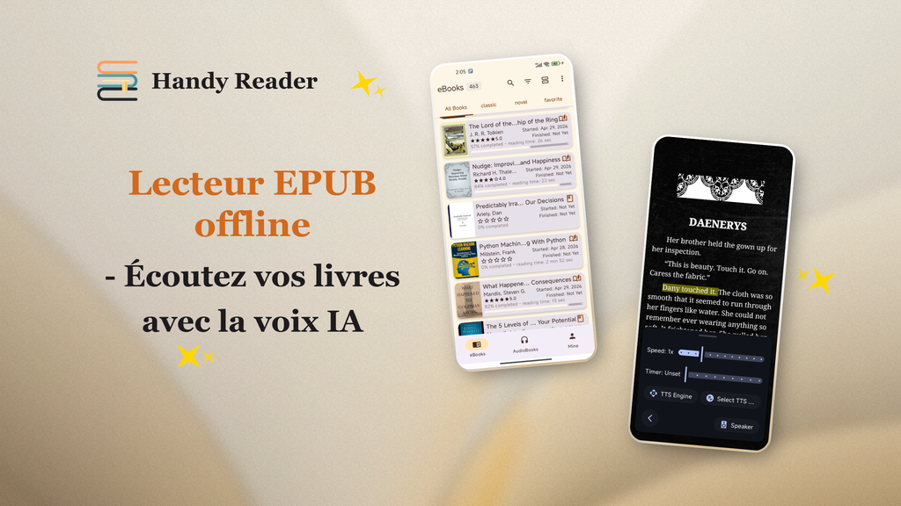

<p align="center">
  
</p>

<p align="center">
  <em>« Lisez librement, écoutez sans fin. »</em>
</p>

<p align="center">
  <a href="../README.md">English</a> | <a href="README.zh.md">中文</a> | <strong>Français</strong> | <a href="README.de.md">Deutsch</a> | <a href="README.es.md">Español</a> | <a href="README.pt.md">Português</a> | <a href="README.ru.md">Русский</a> | <a href="README.hi.md">हिन्दी</a> | <a href="README.ja.md">日本語</a> | <a href="README.ar.md">العربية</a>
</p>

<p align="center">
  <a href="https://www.gnu.org/licenses/gpl-3.0.en.html"></a>
  
  
  <a href="https://handyreader.top/download.html"></a>
</p>

<p align="center">
  <a href="https://play.google.com/store/apps/details?id=com.wxn.reader"><strong>Disponible sur Google Play</strong></a>
  &nbsp;·&nbsp;
  <a href="https://handyreader.top/download.html"><strong>Télécharger l'APK</strong></a>
  &nbsp;·&nbsp;
  <a href="https://github.com/EucWang/HandyReader/releases"><strong>Versions GitHub</strong></a>
</p>

---

HandyReader est une liseuse de livres et de livres audio gratuite et open source pour Android. Elle prend en charge un large éventail de formats, intègre un moteur de synthèse vocale neuronal hors ligne, une personnalisation poussée selon Material You, et conserve toutes vos données sur votre appareil.

## Captures d'écran

<table>
  <tr>
    <td width="25%" align="center"></td>
    <td width="25%" align="center"></td>
    <td width="25%" align="center"></td>
    <td width="25%" align="center"></td>
  </tr>
  <tr>
    <td align="center"><sub>Bibliothèque</sub></td>
    <td align="center"><sub>Lecture</sub></td>
    <td align="center"><sub>Surlignages et notes</sub></td>
    <td align="center"><sub>Synthèse vocale</sub></td>
  </tr>
</table>

## Fonctionnalités

### 📚 Liseuse multi-formats
Lisez des livres et écoutez des livres audio dans une seule application.
- **Livres numériques** : EPUB, MOBI, AZW, AZW3, FB2, TXT, Markdown, HTML, PDF
- **Livres audio** : MP3, M4A, AAC (propulsé par Media3/ExoPlayer)
- Moteur d'analyse natif en C++ (libmobi, libxml2, CSSParser) pour la rapidité et la fidélité

### 🎯 Synthèse vocale IA hors ligne
La fonctionnalité phare. Écoutez n'importe quel livre avec des voix neuronales naturelles — **entièrement hors ligne, aucune connexion Internet requise**.
- Trois moteurs : **IA neuronale hors ligne** (sherpa-onnx), **Edge TTS** (en ligne), **Synthèse vocale système** (solution de repli)
- Lecture en arrière-plan avec contrôles depuis la notification
- Vitesse et tonalité réglables, minuteur de sommeil, saut de chapitre
- Modèles vocaux téléchargeables pour plusieurs langues

### 🎨 Design Material You et personnalisation poussée
- Couleurs dynamiques sur Android 12+ (thème basé sur le fond d'écran via Material You)
- 12 schémas de couleurs, 11 thèmes de lecture
- Arrière-plans de lecture personnalisés (couleurs unies ou images de la galerie)
- Trois sources de polices : polices système, polices téléchargeables depuis le catalogue, ou importez les vôtres

### 📝 Annotations et notes
- Surlignages, soulignements et notes avec couleurs personnalisées
- Recherche dans le livre et filtrage des annotations
- Navigateur de notes dédié

### 📖 Catalogues OPDS en ligne
- Parcourez et téléchargez des livres depuis des catalogues OPDS 1.x en ligne
- Prise en charge de l'authentification (nom d'utilisateur / mot de passe)
- Catalogues publics intégrés + ajoutez les vôtres

### 🃏 Cartes de citations
Générez de belles cartes de citations partageables à partir du texte sélectionné.
- 5 styles : Blanc minimal, Nuit sombre, Parchemin, Affiche de couverture, Grande citation
- 4 ratios d'aspect (3:4, 1:1, 9:16, 4:5)
- Enregistrez dans la galerie ou partagez directement

### 📊 Statistiques de lecture
- Temps de lecture quotidien, total et par livre
- Séries de lecture (en cours et la plus longue)
- Carte thermique des habitudes de lecture
- Suivi de la progression (non commencé / en cours / terminé)

### 🗂️ Bibliothèque intelligente
- Étagères illimitées
- Dispositions en grille et en liste
- Filtrer par statut, type de fichier, dernière ouverture, titre ou progression
- Triez et organisez de vastes collections

### 🔤 Dictionnaire et traduction
- Dictionnaire intégré (WordNet, ECDICT, et plus)
- Traduction IA en ligne (modèle Meta m2/m100)
- Historique des recherches
- Intégration avec des applications de dictionnaire externes

### 🔒 Confidentialité d'abord
- Toutes les données stockées localement sur votre appareil
- Aucune analyse ni suivi tiers
- Entièrement open source sous GPLv3

### 💾 Sauvegarde et restauration
- Exportez/importez vos données de lecture (ZIP)
- Comprend la progression, les annotations, les notes, les signets, les étagères, les statistiques et les préférences
- Fusion intelligente entre appareils basée sur le hachage du contenu

## Pourquoi HandyReader ?

| | HandyReader | Liseuses typiques |
|---|:---:|:---:|
| **Synthèse vocale IA hors ligne** | ✅ Voix neuronales, sans Internet | ❌ Synthèse vocale système uniquement |
| **Prise en charge des livres audio** | ✅ MP3/M4A/AAC | ❌ Livres numériques uniquement |
| **Couverture des formats** | ✅ 12+ formats | ⚠️ Généralement 3-5 |
| **Profondeur de personnalisation** | ✅ Thèmes, polices, arrière-plans, dispositions | ⚠️ Limitée |
| **Open source** | ✅ GPLv3 | ⚠️ Souvent fermé |
| **Cartes de citations** | ✅ Intégré | ❌ Rare |

## Pour commencer

**Configuration requise** : Android 6.0 (API 23) ou supérieur.

1. **Google Play** (recommandé pour les mises à jour automatiques) : [Installer HandyReader](https://play.google.com/store/apps/details?id=com.wxn.reader)
2. **Téléchargement APK** (appareils sans services Google pris en charge) : [Télécharger depuis handyreader.top](https://handyreader.top/download.html)
3. **Versions GitHub** (parcourez toutes les versions) : [Versions](https://github.com/EucWang/HandyReader/releases)

Ouvrez un livre depuis votre appareil ou importez-en un — HandyReader prendra en charge les fichiers EPUB, MOBI, AZW3, FB2, TXT, MD, HTML, PDF et les livres audio. Vous pouvez également ouvrir des fichiers envoyés depuis d'autres applications.

## Bientôt disponible

- 🔄 Synchronisation de la progression de lecture via WebDAV
- 📡 Prise en charge d'OPDS 2.0
- 📚 Prise en charge des formats de bande dessinée CBR/CBZ
- 🎧 Format de livre audio M4B avec prise en charge des chapitres
- 🎙️ Voix Edge TTS en ligne
- 📄 Analyse améliorée des PDF / Markdown / HTML

> Le projet est activement développé. Consultez les [Versions](https://github.com/EucWang/HandyReader/releases) pour les dernières modifications.

## Pile technique

| Catégorie | Technologie |
|---|---|
| **Interface utilisateur** | Jetpack Compose, Material Design 3, Navigation Compose |
| **Injection de dépendances** | Hilt (Dagger) |
| **Base de données** | Room |
| **Préférences** | DataStore |
| **Asynchrone** | Coroutines & Flow |
| **Chargement d'images** | Coil 3 |
| **Lecture multimédia** | Media3 / ExoPlayer |
| **Synthèse vocale** | sherpa-onnx (neuronal hors ligne), Edge TTS, Android TTS |
| **Analyse** | libmobi (C++/JNI), jsoup, CSSParser |
| **Réseau** | Ktor, OkHttp |

## Compiler depuis les sources

Ce projet nécessite **Android Studio Ladybug** (ou plus récent), le **JDK 17** et l'**Android NDK**.

```bash
git clone https://github.com/EucWang/HandyReader.git
cd HandyReader
./gradlew :app:assembleDebug
```

> **Remarque** : Les modules natifs (`mobi`, `jp2forandroid`, `text2speech`) nécessitent le NDK pour la compilation. Compilez sous Windows, macOS ou Linux — consultez la documentation du projet pour plus de détails.

<details>
<summary>Variantes de compilation</summary>

- `assembleDebug` — APK de débogage pour le développement
- `assembleRelease` — APK de version publique (nécessite une configuration de signature dans `key.properties`)
- `bundleRelease` — AAB de version publique pour Google Play

</details>

## Licence

[](https://www.gnu.org/licenses/gpl-3.0.en.html)

Ce projet est sous licence **GNU General Public License v3.0** — consultez le fichier [LICENSE](../LICENSE) pour plus de détails.

## Remerciements

HandyReader s'appuie sur le travail de nombreux projets open source :

- [Skydoves](https://github.com/skydoves) — ColorPicker Compose
- [Shivamdhuria](https://github.com/Shivamdhuria) — Palette library
- [androidSpeech](https://github.com/gotev/android-speech) — Text-to-Speech
- [libmobi](https://github.com/bfabiszewski/libmobi) — MOBI/AZW library
- [tidy-html5](https://github.com/htacg/tidy-html5) — HTML tidy
- [utfcpp](https://github.com/nemtrif/utfcpp) — UTF-8 library
- [CSSParser](https://github.com/luojilab/CSSParser) — CSS parser
- [minizip](http://www.winimage.com/zLibDll/minizip.html) — ZIP library
- [jp2ForAndroid](https://github.com/EucWang/jp2ForAndroid) — JPEG2000 decoder
- [libxml2](https://gitlab.gnome.org/GNOME/libxml2) — XML parser
- [sherpa-onnx](https://github.com/k2-fsa/sherpa-onnx) — Offline neural TTS engine
