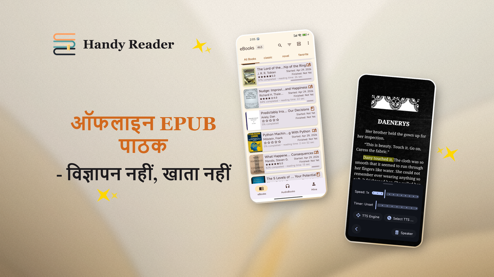

<p align="center">
  
</p>

<p align="center">
  <em>मुफ़्त पढ़ें, अनंत सुनें।</em>
</p>

<p align="center">
  <a href="../README.md">English</a> | <a href="README.zh.md">中文</a> | <a href="README.fr.md">Français</a> | <a href="README.de.md">Deutsch</a> | <a href="README.es.md">Español</a> | <a href="README.pt.md">Português</a> | <a href="README.ru.md">Русский</a> | <strong>हिन्दी</strong> | <a href="README.ja.md">日本語</a> | <a href="README.ar.md">العربية</a>
</p>

<p align="center">
  <a href="https://www.gnu.org/licenses/gpl-3.0.en.html"></a>
  
  
  <a href="https://handyreader.top/download.html"></a>
</p>

<p align="center">
  <a href="https://play.google.com/store/apps/details?id=com.wxn.reader"><strong>Google Play पर पाएँ</strong></a>
  &nbsp;·&nbsp;
  <a href="https://handyreader.top/download.html"><strong>APK डाउनलोड करें</strong></a>
  &nbsp;·&nbsp;
  <a href="https://github.com/EucWang/HandyReader/releases"><strong>GitHub रिलीज़</strong></a>
</p>

---

HandyReader Android के लिए एक मुफ़्त, मुक्त-स्रोत ई-बुक और ऑडियोबुक रीडर है। यह कई तरह के फ़ॉर्मैट का समर्थन करता है, इसमें एक ऑफ़लाइन न्यूरल AI टेक्स्ट-टू-स्पीच इंजन और Material You की गहन अनुकूलन सुविधा मौजूद है, और यह आपका सारा डेटा आपके डिवाइस पर ही रखता है।

## स्क्रीनशॉट

<table>
  <tr>
    <td width="25%" align="center"></td>
    <td width="25%" align="center"></td>
    <td width="25%" align="center"></td>
    <td width="25%" align="center"></td>
  </tr>
  <tr>
    <td align="center"><sub>पुस्तकालय</sub></td>
    <td align="center"><sub>पढ़ना</sub></td>
    <td align="center"><sub>हाइलाइट और नोट्स</sub></td>
    <td align="center"><sub>टेक्स्ट-टू-स्पीच</sub></td>
  </tr>
</table>

## विशेषताएँ

### 📚 मल्टी-फ़ॉर्मैट रीडर
एक ही ऐप में ई-बुक पढ़ें और ऑडियोबुक सुनें।
- **ई-बुक**: EPUB, MOBI, AZW, AZW3, FB2, TXT, Markdown, HTML, PDF
- **ऑडियोबुक**: MP3, M4A, AAC (Media3/ExoPlayer द्वारा संचालित)
- गति और सटीकता के लिए नेटिव C++ पार्सिंग इंजन (libmobi, libxml2, CSSParser)

### 🎯 ऑफ़लाइन AI टेक्स्ट-टू-स्पीच
यह इसकी सबसे खास विशेषता है। किसी भी पुस्तक को स्वाभाविक न्यूरल-नेटवर्क आवाज़ों में सुनें — **पूरी तरह ऑफ़लाइन, बिना इंटरनेट के**।
- तीन इंजन: **ऑफ़लाइन न्यूरल AI** (sherpa-onnx), **Edge TTS** (ऑनलाइन), **सिस्टम TTS** (फ़ॉलबैक)
- नोटिफ़िकेशन नियंत्रण के साथ बैकग्राउंड प्लेबैक
- समायोज्य गति और पिच, स्लीप टाइमर, अध्याय स्किप करना
- कई भाषाओं के लिए डाउनलोड करने योग्य वॉइस मॉडल

### 🎨 Material You डिज़ाइन और गहन अनुकूलन
- Android 12+ पर डायनामिक रंग (वॉलपेपर आधारित Material You थीमिंग)
- 12 रंग योजनाएँ, 11 पढ़ने की थीम
- कस्टम पढ़ने की पृष्ठभूमि (ठोस रंग या गैलरी से इमेज)
- फ़ॉन्ट के तीन स्रोत: सिस्टम फ़ॉन्ट, कैटलॉग से डाउनलोड करने योग्य फ़ॉन्ट, या अपना खुद का आयात

### 📝 एनोटेशन और नोट्स
- कस्टम रंगों के साथ हाइलाइट, रेखांकित और नोट्स
- पुस्तक के भीतर खोज और एनोटेशन फ़िल्टर करना
- समर्पित नोट्स ब्राउज़र

### 📖 OPDS ऑनलाइन कैटलॉग
- OPDS 1.x ऑनलाइन कैटलॉग से पुस्तकें ब्राउज़ करें और डाउनलोड करें
- प्रमाणीकरण समर्थन (उपयोगकर्ता नाम/पासवर्ड)
- अंतर्निहित सार्वजनिक कैटलॉग + अपने खुद के जोड़ें

### 🃏 क्वोट कार्ड
चयनित टेक्स्ट से सुंदर, साझा करने योग्य क्वोट कार्ड बनाएँ।
- 5 शैलियाँ: मिनिमल व्हाइट, डार्क नाइट, पर्चमेंट, कवर पोस्टर, बिग क्वोट
- 4 पक्ष अनुपात (3:4, 1:1, 9:16, 4:5)
- गैलरी में सहेजें या सीधे साझा करें

### 📊 पढ़ने के आँकड़े
- दैनिक, कुल और प्रति-पुस्तक पढ़ने का समय
- पढ़ने की लगातार श्रृंखला (वर्तमान और सबसे लंबी)
- पढ़ने की आदतों की हीटमैप
- प्रगति ट्रैकिंग (शुरू नहीं हुआ / जारी / पूर्ण)

### 🗂️ स्मार्ट पुस्तकालय
- असीमित शेल्फ़
- ग्रिड और सूची लेआउट
- स्थिति, फ़ाइल प्रकार, अंतिम बार खोला गया, शीर्षक या प्रगति के अनुसार फ़िल्टर करें
- बड़े संग्रह को क्रमबद्ध और व्यवस्थित करें

### 🔤 शब्दकोश और अनुवाद
- अंतर्निहित शब्दकोश (WordNet, ECDICT और अधिक)
- ऑनलाइन AI अनुवाद (Meta m2/m100 मॉडल)
- खोज इतिहास
- बाहरी शब्दकोश ऐप्स के साथ एकीकरण

### 🔒 गोपनीयता पहले
- सारा डेटा आपके डिवाइस पर ही स्थानीय रूप से संग्रहीत
- कोई थर्ड-पार्टी एनालिटिक्स या ट्रैकिंग नहीं
- GPLv3 के तहत पूरी तरह मुक्त-स्रोत

### 💾 बैकअप और पुनर्स्थापना
- अपना पढ़ने का डेटा निर्यात/आयात करें (ZIP)
- इसमें प्रगति, एनोटेशन, नोट्स, बुकमार्क, शेल्फ़, आँकड़े और प्राथमिकताएँ शामिल हैं
- डिवाइस के बीच कंटेंट-हैश आधारित स्मार्ट विलय

## HandyReader क्यों?

| | HandyReader | सामान्य रीडर |
|---|:---:|:---:|
| **ऑफ़लाइन AI TTS** | ✅ न्यूरल आवाज़ें, इंटरनेट नहीं | ❌ केवल सिस्टम TTS |
| **ऑडियोबुक समर्थन** | ✅ MP3/M4A/AAC | ❌ केवल ई-बुक |
| **फ़ॉर्मैट कवरेज** | ✅ 12+ फ़ॉर्मैट | ⚠️ आमतौर पर 3–5 |
| **अनुकूलन गहराई** | ✅ थीम, फ़ॉन्ट, पृष्ठभूमि, लेआउट | ⚠️ सीमित |
| **ओपन सोर्स** | ✅ GPLv3 | ⚠️ अक्सर बंद |
| **क्वोट कार्ड** | ✅ अंतर्निहित | ❌ दुर्लभ |

## शुरुआत करें

**आवश्यकताएँ**: Android 6.0 (API 23) या उच्चतर।

1. **Google Play** (ऑटो-अपडेट के लिए अनुशंसित): [HandyReader इंस्टॉल करें](https://play.google.com/store/apps/details?id=com.wxn.reader)
2. **APK डाउनलोड** (Google सेवाओं के बिना डिवाइस समर्थित): [handyreader.top से डाउनलोड करें](https://handyreader.top/download.html)
3. **GitHub रिलीज़** (सभी संस्करण ब्राउज़ करें): [रिलीज़](https://github.com/EucWang/HandyReader/releases)

अपने डिवाइस से कोई पुस्तक खोलें या आयात करें — HandyReader आपकी EPUB, MOBI, AZW3, FB2, TXT, MD, HTML, PDF और ऑडियोबुक फ़ाइलों को संभाल लेगा। आप अन्य ऐप्स से भेजी गई फ़ाइलें भी खोल सकते हैं।

## जल्द आ रहा है

- 🔄 WebDAV पर पढ़ने की प्रगति सिंक
- 📡 OPDS 2.0 समर्थन
- 📚 CBR/CBZ कॉमिक फ़ॉर्मैट समर्थन
- 🎧 अध्याय समर्थन के साथ M4B ऑडियोबुक फ़ॉर्मैट
- 🎙️ ऑनलाइन Edge TTS आवाज़ें
- 📄 बेहतर PDF / Markdown / HTML पार्सिंग

> इस प्रोजेक्ट का सक्रिय रूप से विकास हो रहा है। नवीनतम बदलावों के लिए [रिलीज़](https://github.com/EucWang/HandyReader/releases) देखें।

## तकनीकी स्टैक

| श्रेणी | तकनीक |
|---|---|
| **UI** | Jetpack Compose, Material Design 3, Navigation Compose |
| **DI** | Hilt (Dagger) |
| **डेटाबेस** | Room |
| **प्राथमिकताएँ** | DataStore |
| **एसिंक्रोनस** | Coroutines & Flow |
| **इमेज लोडिंग** | Coil 3 |
| **मीडिया प्लेबैक** | Media3 / ExoPlayer |
| **TTS** | sherpa-onnx (ऑफ़लाइन न्यूरल), Edge TTS, Android TTS |
| **पार्सिंग** | libmobi (C++/JNI), jsoup, CSSParser |
| **नेटवर्किंग** | Ktor, OkHttp |

## सोर्स से बिल्ड करें

इस प्रोजेक्ट के लिए **Android Studio Ladybug** (या नया), **JDK 17** और **Android NDK** की आवश्यकता है।

```bash
git clone https://github.com/EucWang/HandyReader.git
cd HandyReader
./gradlew :app:assembleDebug
```

> **नोट**: नेटिव मॉड्यूल (`mobi`, `jp2forandroid`, `text2speech`) को संकलित करने के लिए NDK की आवश्यकता है। Windows, macOS या Linux पर बिल्ड करें — विवरण के लिए प्रोजेक्ट दस्तावेज़ देखें।

<details>
<summary>बिल्ड वेरिएंट</summary>

- `assembleDebug` — विकास के लिए डिबग APK
- `assembleRelease` — रिलीज़ APK (`key.properties` में साइनिंग कॉन्फ़िगरेशन आवश्यक)
- `bundleRelease` — Google Play के लिए रिलीज़ AAB

</details>

## लाइसेंस

[](https://www.gnu.org/licenses/gpl-3.0.en.html)

यह प्रोजेक्ट **GNU General Public License v3.0** के तहत लाइसेंस प्राप्त है — विवरण के लिए [LICENSE](../LICENSE) फ़ाइल देखें।

## आभार

HandyReader कई मुक्त-स्रोत प्रोजेक्ट्स के काम पर आधारित है:

- [Skydoves](https://github.com/skydoves) — ColorPicker Compose
- [Shivamdhuria](https://github.com/Shivamdhuria) — Palette library
- [androidSpeech](https://github.com/gotev/android-speech) — Text-to-Speech
- [libmobi](https://github.com/bfabiszewski/libmobi) — MOBI/AZW library
- [tidy-html5](https://github.com/htacg/tidy-html5) — HTML tidy
- [utfcpp](https://github.com/nemtrif/utfcpp) — UTF-8 library
- [CSSParser](https://github.com/luojilab/CSSParser) — CSS parser
- [minizip](http://www.winimage.com/zLibDll/minizip.html) — ZIP library
- [jp2ForAndroid](https://github.com/EucWang/jp2ForAndroid) — JPEG2000 decoder
- [libxml2](https://gitlab.gnome.org/GNOME/libxml2) — XML parser
- [sherpa-onnx](https://github.com/k2-fsa/sherpa-onnx) — Offline neural TTS engine
