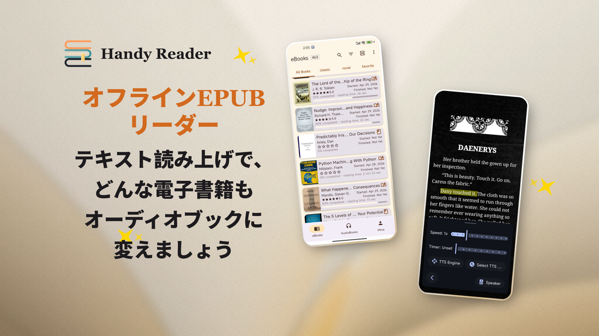

<p align="center">
  
</p>

<p align="center">
  <em>自由に読んで、果てしなく聴こう。</em>
</p>

<p align="center">
  <a href="../README.md">English</a> | <a href="README.zh.md">中文</a> | <a href="README.fr.md">Français</a> | <a href="README.de.md">Deutsch</a> | <a href="README.es.md">Español</a> | <a href="README.pt.md">Português</a> | <a href="README.ru.md">Русский</a> | <a href="README.hi.md">हिन्दी</a> | <strong>日本語</strong> | <a href="README.ar.md">العربية</a>
</p>

<p align="center">
  <a href="https://www.gnu.org/licenses/gpl-3.0.en.html"></a>
  
  
  <a href="https://handyreader.top/download.html"></a>
</p>

<p align="center">
  <a href="https://play.google.com/store/apps/details?id=com.wxn.reader"><strong>Google Playで入手</strong></a>
  &nbsp;·&nbsp;
  <a href="https://handyreader.top/download.html"><strong>APKをダウンロード</strong></a>
  &nbsp;·&nbsp;
  <a href="https://github.com/EucWang/HandyReader/releases"><strong>GitHub Releases</strong></a>
</p>

---

HandyReaderは、Android向けの無料・オープンソースの電子書籍・オーディオブックリーダーです。幅広いフォーマットに対応し、オフラインで動作するニューラルAIテキスト読み上げエンジン、Material Youによる深いカスタマイズを備え、すべてのデータをデバイス上に保存します。

## スクリーンショット

<table>
  <tr>
    <td width="25%" align="center"></td>
    <td width="25%" align="center"></td>
    <td width="25%" align="center"></td>
    <td width="25%" align="center"></td>
  </tr>
  <tr>
    <td align="center"><sub>ライブラリ</sub></td>
    <td align="center"><sub>読書</sub></td>
    <td align="center"><sub>ハイライトとメモ</sub></td>
    <td align="center"><sub>テキスト読み上げ</sub></td>
  </tr>
</table>

## 主な機能

### 📚 マルチフォーマットリーダー
電子書籍の閲覧も、オーディオブックの視聴も、1つのアプリで。
- **電子書籍**: EPUB、MOBI、AZW、AZW3、FB2、TXT、Markdown、HTML、PDF
- **オーディオブック**: MP3、M4A、AAC（Media3/ExoPlayer搭載）
- 高速かつ高忠実度なC++ネイティブ解析エンジン（libmobi、libxml2、CSSParser）

### 🎯 オフラインAIテキスト読み上げ
最大の特徴です。自然なニューラルネットワーク音声でどんな本でも読み上げます — **完全オフライン、インターネット不要**。
- 3つのエンジン：**オフラインニューラルAI**（sherpa-onnx）、**Edge TTS**（オンライン）、**システムTTS**（フォールバック）
- 通知コントロール付きのバックグラウンド再生
- 速度とピッチの調整、スリープタイマー、チャプタースキップ
- 複数言語の音声モデルをダウンロード可能

### 🎨 Material Youデザインと深いカスタマイズ
- Android 12以上でダイナミックカラー（Material Youの壁紙ベースのテーマ設定）
- 12種類のカラースキーム、11種類の読書テーマ
- カスタム読書背景（単色またはギャラリーの画像）
- 3つのフォントソース：システムフォント、ダウンロード可能なカタログフォント、または独自フォントのインポート

### 📝 注釈とメモ
- カスタムカラー付きのハイライト、下線、メモ
- 書籍内検索と注釈のフィルタリング
- 専用のメモブラウザ

### 📖 OPDSオンラインカタログ
- OPDS 1.xオンラインカタログから書籍の閲覧とダウンロード
- 認証サポート（ユーザー名/パスワード）
- 組み込みの公開カタログ + 自分のカタログを追加

### 🃏 引用カード
選択したテキストから、美しくシェア可能な引用カードを生成。
- 5種類のスタイル：ミニマルホワイト、ダークナイト、パーチメント、カバーポスター、ビッグクォート
- 4種類のアスペクト比（3:4、1:1、9:16、4:5）
- ギャラリーに保存、または直接シェア

### 📊 読書統計
- 1日ごと、合計、書籍ごとの読書時間
- 連続読書記録（現在と最長）
- 読書習慣のヒートマップ
- 進捗トラッキング（未開始 / 読書中 / 読了）

### 🗂️ スマートライブラリ
- 無制限の本棚
- グリッドとリストのレイアウト
- ステータス、ファイル形式、最終オープン、タイトル、進捗でフィルタリング
- 大規模コレクションの並べ替えと整理

### 🔤 辞書と翻訳
- 組み込み辞書（WordNet、ECDICTなど）
- オンラインAI翻訳（Meta m2/m100モデル）
- 検索履歴
- 外部辞書アプリとの連携

### 🔒 プライバシー第一
- すべてのデータをデバイス上にローカル保存
- サードパーティの分析やトラッキングなし
- GPLv3で完全オープンソース

### 💾 バックアップと復元
- 読書データのエクスポート/インポート（ZIP）
- 進捗、注釈、メモ、ブックマーク、本棚、統計、設定を含む
- コンテンツハッシュベースのデバイス間スマートマージ

## なぜHandyReader？

| | HandyReader | 一般的なリーダー |
|---|:---:|:---:|
| **オフラインAI TTS** | ✅ ニューラル音声、インターネット不要 | ❌ システムTTSのみ |
| **オーディオブック対応** | ✅ MP3/M4A/AAC | ❌ 電子書籍のみ |
| **フォーマット対応** | ✅ 12種類以上 | ⚠️ 通常3〜5種類 |
| **カスタマイズの深さ** | ✅ テーマ、フォント、背景、レイアウト | ⚠️ 限定的 |
| **オープンソース** | ✅ GPLv3 | ⚠️ 多くはクローズド |
| **引用カード** | ✅ 組み込み | ❌ 稀 |

## はじめに

**要件**: Android 6.0（API 23）以上。

1. **Google Play**（自動更新におすすめ）: [HandyReaderをインストール](https://play.google.com/store/apps/details?id=com.wxn.reader)
2. **APKダウンロード**（Googleサービス非搭載デバイス対応）: [handyreader.topからダウンロード](https://handyreader.top/download.html)
3. **GitHub Releases**（すべてのバージョンを閲覧）: [Releases](https://github.com/EucWang/HandyReader/releases)

デバイスから本を開くか、インポートしてください — HandyReaderはEPUB、MOBI、AZW3、FB2、TXT、MD、HTML、PDF、およびオーディオブックファイルを処理できます。他のアプリから送信されたファイルを開くことも可能です。

## 近日公開

- 🔄 WebDAV読書進捗同期
- 📡 OPDS 2.0サポート
- 📚 CBR/CBZコミックフォーマットサポート
- 🎧 チャプターサポート付きM4Bオーディオブックフォーマット
- 🎙️ オンラインEdge TTS音声
- 📄 PDF / Markdown / HTML解析の改善

> 本プロジェクトは積極的に開発されています。最新の変更については[Releases](https://github.com/EucWang/HandyReader/releases)をご確認ください。

## 技術スタック

| カテゴリ | 技術 |
|---|---|
| **UI** | Jetpack Compose, Material Design 3, Navigation Compose |
| **DI** | Hilt (Dagger) |
| **データベース** | Room |
| **設定** | DataStore |
| **非同期** | Coroutines & Flow |
| **画像読み込み** | Coil 3 |
| **メディア再生** | Media3 / ExoPlayer |
| **TTS** | sherpa-onnx (オフラインニューラル), Edge TTS, Android TTS |
| **解析** | libmobi (C++/JNI), jsoup, CSSParser |
| **ネットワーク** | Ktor, OkHttp |

## ソースからビルド

このプロジェクトには**Android Studio Ladybug**（またはそれ以降）、**JDK 17**、**Android NDK**が必要です。

```bash
git clone https://github.com/EucWang/HandyReader.git
cd HandyReader
./gradlew :app:assembleDebug
```

> **注意**: ネイティブモジュール（`mobi`、`jp2forandroid`、`text2speech`）のコンパイルにはNDKが必要です。Windows、macOS、またはLinuxでビルド可能です — 詳細はプロジェクトドキュメントをご参照ください。

<details>
<summary>ビルドバリアント</summary>

- `assembleDebug` — 開発用のデバッグAPK
- `assembleRelease` — リリースAPK（`key.properties`の署名設定が必要）
- `bundleRelease` — Google Play向けのリリースAAB

</details>

## ライセンス

[](https://www.gnu.org/licenses/gpl-3.0.en.html)

このプロジェクトは**GNU General Public License v3.0**の下でライセンスされています — 詳細は[LICENSE](../LICENSE)ファイルをご参照ください。

## 謝辞

HandyReaderは多くのオープンソースプロジェクトの成果の上に成り立っています:

- [Skydoves](https://github.com/skydoves) — ColorPicker Compose
- [Shivamdhuria](https://github.com/Shivamdhuria) — Palette library
- [androidSpeech](https://github.com/gotev/android-speech) — Text-to-Speech
- [libmobi](https://github.com/bfabiszewski/libmobi) — MOBI/AZW library
- [tidy-html5](https://github.com/htacg/tidy-html5) — HTML tidy
- [utfcpp](https://github.com/nemtrif/utfcpp) — UTF-8 library
- [CSSParser](https://github.com/luojilab/CSSParser) — CSS parser
- [minizip](http://www.winimage.com/zLibDll/minizip.html) — ZIP library
- [jp2ForAndroid](https://github.com/EucWang/jp2ForAndroid) — JPEG2000 decoder
- [libxml2](https://gitlab.gnome.org/GNOME/libxml2) — XML parser
- [sherpa-onnx](https://github.com/k2-fsa/sherpa-onnx) — Offline neural TTS engine
