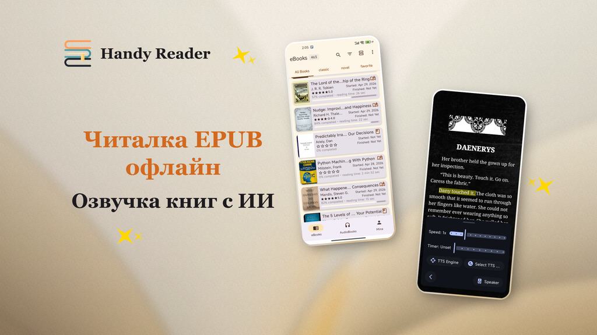

<p align="center">
  
</p>

<p align="center">
  <em>Читайте свободно, слушайте бесконечно.</em>
</p>

<p align="center">
  <a href="../README.md">English</a> | <a href="README.zh.md">中文</a> | <a href="README.fr.md">Français</a> | <a href="README.de.md">Deutsch</a> | <a href="README.es.md">Español</a> | <a href="README.pt.md">Português</a> | <strong>Русский</strong> | <a href="README.hi.md">हिन्दी</a> | <a href="README.ja.md">日本語</a> | <a href="README.ar.md">العربية</a>
</p>

<p align="center">
  <a href="https://www.gnu.org/licenses/gpl-3.0.en.html"></a>
  
  
  <a href="https://handyreader.top/download.html"></a>
</p>

<p align="center">
  <a href="https://play.google.com/store/apps/details?id=com.wxn.reader"><strong>Скачать в Google Play</strong></a>
  &nbsp;·&nbsp;
  <a href="https://handyreader.top/download.html"><strong>Скачать APK</strong></a>
  &nbsp;·&nbsp;
  <a href="https://github.com/EucWang/HandyReader/releases"><strong>Релизы на GitHub</strong></a>
</p>

---

HandyReader — это бесплатная читалка электронных книг и аудиокниг для Android с открытым исходным кодом. Она поддерживает множество форматов, оснащена офлайн-движком нейросетевого синтеза речи, предлагает глубокую настройку в духе Material You и хранит все ваши данные на устройстве.

## Скриншоты

<table>
  <tr>
    <td width="25%" align="center"></td>
    <td width="25%" align="center"></td>
    <td width="25%" align="center"></td>
    <td width="25%" align="center"></td>
  </tr>
  <tr>
    <td align="center"><sub>Библиотека</sub></td>
    <td align="center"><sub>Чтение</sub></td>
    <td align="center"><sub>Выделения и заметки</sub></td>
    <td align="center"><sub>Текст в речь</sub></td>
  </tr>
</table>

## Возможности

### 📚 Мультиформатная читалка
Читайте электронные книги и слушайте аудиокниги в одном приложении.
- **Электронные книги**: EPUB, MOBI, AZW, AZW3, FB2, TXT, Markdown, HTML, PDF
- **Аудиокниги**: MP3, M4A, AAC (на базе Media3/ExoPlayer)
- Нативный движок разбора на C++ (libmobi, libxml2, CSSParser) для скорости и точности

### 🎯 Офлайн ИИ-синтез речи
Главная особенность. Слушайте любую книгу естественными нейросетевыми голосами — **полностью офлайн, без интернета**.
- Три движка: **Офлайн нейросетевой ИИ** (sherpa-onnx), **Edge TTS** (онлайн), **Системный TTS** (запасной)
- Воспроизведение в фоне с управлением из уведомлений
- Регулируемые скорость и тон, таймер сна, переключение глав
- Загружаемые модели голосов для нескольких языков

### 🎨 Дизайн Material You и глубокая настройка
- Динамические цвета на Android 12+ (тематизация на основе обоев Material You)
- 12 цветовых схем, 11 тем для чтения
- Настраиваемые фоны для чтения (однотонные цвета или изображения из галереи)
- Три источника шрифтов: системные шрифты, загружаемые из каталога или собственные импортированные

### 📝 Аннотации и заметки
- Выделения, подчёркивания и заметки с собственными цветами
- Поиск по книге и фильтрация аннотаций
- Отдельный браузер заметок

### 📖 Онлайн-каталоги OPDS
- Просматривайте и скачивайте книги из онлайн-каталогов OPDS 1.x
- Поддержка аутентификации (имя пользователя/пароль)
- Встроенные публичные каталоги + добавляйте свои

### 🃏 Карточки с цитатами
Создавайте красивые карточки с цитатами из выбранного текста, которые легко отправить.
- 5 стилей: «Минимализм», «Тёмная ночь», «Пергамент», «Постер с обложкой», «Большая цитата»
- 4 соотношения сторон (3:4, 1:1, 9:16, 4:5)
- Сохранение в галерею или прямой обмен

### 📊 Статистика чтения
- Ежедневное, общее и по каждой книге время чтения
- Серии чтения (текущая и самая длинная)
- Тепловая карта привычек чтения
- Отслеживание прогресса (не начато / в процессе / завершено)

### 🗂️ Умная библиотека
- Неограниченное количество полок
- Сетка и список
- Фильтрация по статусу, типу файла, последнему открытию, названию или прогрессу
- Сортировка и организация больших коллекций

### 🔤 Словарь и перевод
- Встроенный словарь (WordNet, ECDICT и др.)
- Онлайн-перевод с помощью ИИ (модель Meta m2/m100)
- История просмотра
- Интеграция с внешними приложениями-словарями

### 🔒 Приватность прежде всего
- Все данные хранятся локально на вашем устройстве
- Никакой сторонней аналитики или отслеживания
- Полностью открытый исходный код под лицензией GPLv3

### 💾 Резервное копирование и восстановление
- Экспорт/импорт данных о чтении (ZIP)
- Включает прогресс, аннотации, заметки, закладки, полки, статистику и настройки
- Умное слияние на основе хеша содержимого между устройствами

## Почему HandyReader?

| | HandyReader | Обычные читалки |
|---|:---:|:---:|
| **Офлайн ИИ TTS** | ✅ Нейросетевые голоса, без интернета | ❌ Только системный TTS |
| **Поддержка аудиокниг** | ✅ MP3/M4A/AAC | ❌ Только электронные книги |
| **Покрытие форматов** | ✅ 12+ форматов | ⚠️ Обычно 3–5 |
| **Глубина настройки** | ✅ Темы, шрифты, фоны, макеты | ⚠️ Ограничено |
| **Открытый исходный код** | ✅ GPLv3 | ⚠️ Часто закрытый |
| **Карточки с цитатами** | ✅ Встроено | ❌ Редко |

## Начало работы

**Требования**: Android 6.0 (API 23) или выше.

1. **Google Play** (рекомендуется для автообновлений): [Установить HandyReader](https://play.google.com/store/apps/details?id=com.wxn.reader)
2. **Скачивание APK** (поддерживаются устройства без сервисов Google): [Скачать с handyreader.top](https://handyreader.top/download.html)
3. **Релизы на GitHub** (просмотр всех версий): [Релизы](https://github.com/EucWang/HandyReader/releases)

Откройте книгу на вашем устройстве или импортируйте её — HandyReader обработает EPUB, MOBI, AZW3, FB2, TXT, MD, HTML, PDF и файлы аудиокниг. Вы также можете открывать файлы, отправленные из других приложений.

## В планах

- 🔄 Синхронизация прогресса чтения через WebDAV
- 📡 Поддержка OPDS 2.0
- 📚 Поддержка форматов комиксов CBR/CBZ
- 🎧 Формат аудиокниг M4B с поддержкой глав
- 🎙️ Онлайн-голоса Edge TTS
- 📄 Улучшенный разбор PDF / Markdown / HTML

> Проект активно развивается. Смотрите [Релизы](https://github.com/EucWang/HandyReader/releases), чтобы узнать о последних изменениях.

## Технологический стек

| Категория | Технология |
|---|---|
| **UI** | Jetpack Compose, Material Design 3, Navigation Compose |
| **DI** | Hilt (Dagger) |
| **База данных** | Room |
| **Настройки** | DataStore |
| **Асинхронность** | Coroutines & Flow |
| **Загрузка изображений** | Coil 3 |
| **Воспроизведение медиа** | Media3 / ExoPlayer |
| **TTS** | sherpa-onnx (офлайн-нейросеть), Edge TTS, Android TTS |
| **Разбор** | libmobi (C++/JNI), jsoup, CSSParser |
| **Сетевое взаимодействие** | Ktor, OkHttp |

## Сборка из исходного кода

Для этого проекта требуются **Android Studio Ladybug** (или новее), **JDK 17** и **Android NDK**.

```bash
git clone https://github.com/EucWang/HandyReader.git
cd HandyReader
./gradlew :app:assembleDebug
```

> **Примечание**: Нативные модули (`mobi`, `jp2forandroid`, `text2speech`) требуют NDK для компиляции. Сборка возможна на Windows, macOS или Linux — подробности см. в документации проекта.

<details>
<summary>Варианты сборки</summary>

- `assembleDebug` — Отладочный APK для разработки
- `assembleRelease` — Релизный APK (требуется конфигурация подписи в `key.properties`)
- `bundleRelease` — Релизный AAB для Google Play

</details>

## Лицензия

[](https://www.gnu.org/licenses/gpl-3.0.en.html)

Этот проект лицензирован под **GNU General Public License v3.0** — подробности см. в файле [LICENSE](../LICENSE).

## Благодарности

HandyReader опирается на труд множества проектов с открытым исходным кодом:

- [Skydoves](https://github.com/skydoves) — ColorPicker Compose
- [Shivamdhuria](https://github.com/Shivamdhuria) — Palette library
- [androidSpeech](https://github.com/gotev/android-speech) — Text-to-Speech
- [libmobi](https://github.com/bfabiszewski/libmobi) — MOBI/AZW library
- [tidy-html5](https://github.com/htacg/tidy-html5) — HTML tidy
- [utfcpp](https://github.com/nemtrif/utfcpp) — UTF-8 library
- [CSSParser](https://github.com/luojilab/CSSParser) — CSS parser
- [minizip](http://www.winimage.com/zLibDll/minizip.html) — ZIP library
- [jp2ForAndroid](https://github.com/EucWang/jp2ForAndroid) — JPEG2000 decoder
- [libxml2](https://gitlab.gnome.org/GNOME/libxml2) — XML parser
- [sherpa-onnx](https://github.com/k2-fsa/sherpa-onnx) — Offline neural TTS engine
