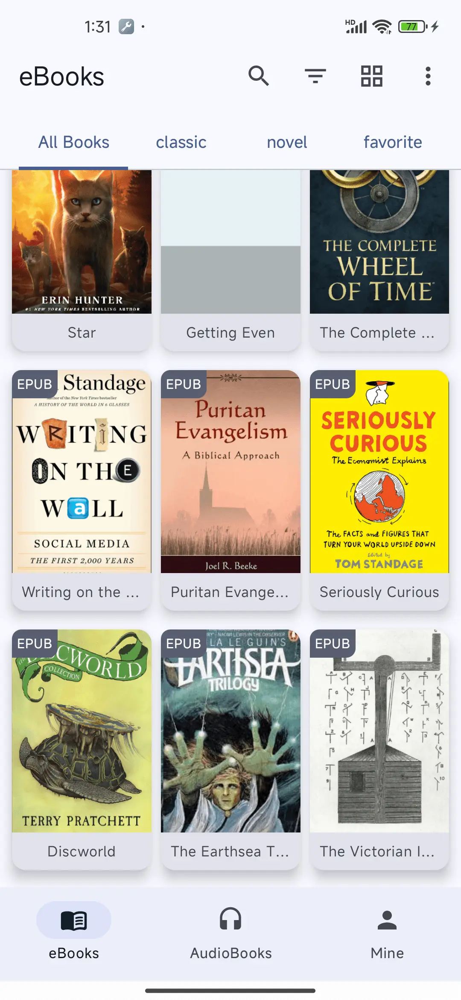
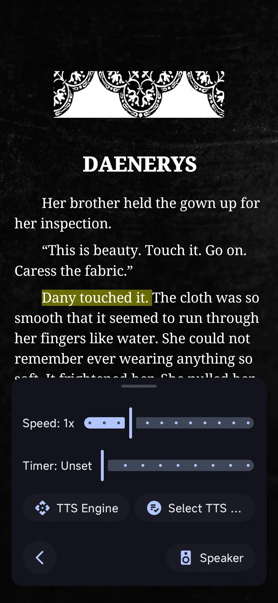

<p align="center">
  
</p>

<p align="center">
  <em>自由阅读，无尽聆听。</em>
</p>

<p align="center">
  <a href="../README.md">English</a> | <strong>中文</strong> | <a href="README.fr.md">Français</a> | <a href="README.de.md">Deutsch</a> | <a href="README.es.md">Español</a> | <a href="README.pt.md">Português</a> | <a href="README.ru.md">Русский</a> | <a href="README.hi.md">हिन्दी</a> | <a href="README.ja.md">日本語</a> | <a href="README.ar.md">العربية</a>
</p>

<p align="center">
  <a href="https://www.gnu.org/licenses/gpl-3.0.en.html"></a>
  
  
  <a href="https://handyreader.top/download.html"></a>
</p>

<p align="center">
  <a href="https://play.google.com/store/apps/details?id=com.wxn.reader"><strong>Google Play 下载</strong></a>
  &nbsp;·&nbsp;
  <a href="https://handyreader.top/download.html"><strong>直接下载 APK</strong></a>
  &nbsp;·&nbsp;
  <a href="https://github.com/EucWang/HandyReader/releases"><strong>GitHub Releases</strong></a>
</p>

---

HandyReader 是一款免费、开源的 Android 电子书与有声书阅读器。支持丰富的文件格式，内置离线神经网络 AI 语音朗读引擎，深度适配 Material You 个性化主题，所有数据完全保留在你的设备本地。

## 应用截图

<table>
  <tr>
    <td width="25%" align="center"></td>
    <td width="25%" align="center"></td>
    <td width="25%" align="center"></td>
    <td width="25%" align="center"></td>
  </tr>
  <tr>
    <td align="center"><sub>书库</sub></td>
    <td align="center"><sub>阅读</sub></td>
    <td align="center"><sub>高亮与笔记</sub></td>
    <td align="center"><sub>语音朗读</sub></td>
  </tr>
</table>

## 功能特性

### 📚 多格式阅读器
一个应用即可阅读电子书、收听有声书。
- **电子书**：EPUB、MOBI、AZW、AZW3、FB2、TXT、Markdown、HTML、PDF
- **有声书**：MP3、M4A、AAC（基于 Media3 / ExoPlayer）
- 原生 C++ 解析引擎（libmobi、libxml2、CSSParser），性能强劲、还原度高

### 🎯 离线 AI 语音朗读
最具特色的功能。使用自然的神经网络语音朗读任何书籍——**完全离线，无需联网**。
- 三种引擎：**离线神经网络 AI**（sherpa-onnx）、**Edge TTS 语音**（在线）、**系统 TTS**（兜底）
- 后台播放，支持通知栏控制
- 可调节语速、音高，睡眠定时器，章节跳转
- 支持下载多种语言的语音模型

### 🎨 Material You 设计与深度个性化
- Android 12+ 动态取色（根据壁纸生成配色方案）
- 12 种配色方案，11 种阅读主题
- 自定义阅读背景（纯色或相册图片）
- 三种字体来源：系统字体、在线目录下载、本地导入

### 📝 批注与笔记
- 高亮、下划线、笔记，支持自定义颜色
- 书内全文搜索与批注筛选
- 独立的笔记浏览页面

### 📖 OPDS 在线书库
- 浏览和下载 OPDS 1.x 在线书库中的书籍
- 支持认证（用户名 / 密码）
- 内置公共书库 + 自定义书库

### 🃏 引文卡片
从选中的文本生成精美的可分享卡片。
- 5 种样式：极简白、暗夜黑、羊皮纸、封面海报、大字引言
- 4 种宽高比（3:4、1:1、9:16、4:5）
- 保存到相册或直接分享

### 📊 阅读统计
- 每日、累计、单本书阅读时长
- 连续阅读天数（当前 / 最长）
- 阅读习惯热力图
- 进度追踪（未开始 / 阅读中 / 已完成）

### 🗂️ 智能书库
- 无限书架
- 网格 / 列表布局
- 按阅读状态、文件类型、最后打开、标题、进度筛选
- 大容量藏书排序与整理

### 🔤 词典与翻译
- 内置词典（WordNet、ECDICT 等）
- 在线 AI 翻译（Meta m2/m100 模型）
- 查询历史
- 集成第三方词典应用

### 🔒 隐私优先
- 所有数据完全存储在设备本地
- 无第三方分析或追踪
- 完全开源（GPLv3）

### 💾 备份与还原
- 导出 / 导入阅读数据（ZIP 文件）
- 包含进度、批注、笔记、书签、书架、统计、偏好设置
- 基于内容哈希的跨设备智能合并

## 为什么选择 HandyReader？

| | HandyReader | 普通阅读器 |
|---|:---:|:---:|
| **离线 AI 语音朗读** | ✅ 神经网络语音，无需联网 | ❌ 仅系统 TTS |
| **有声书支持** | ✅ MP3/M4A/AAC | ❌ 仅电子书 |
| **格式覆盖** | ✅ 12+ 种格式 | ⚠️ 通常 3-5 种 |
| **个性化深度** | ✅ 主题、字体、背景、布局 | ⚠️ 有限 |
| **开源** | ✅ GPLv3 | ⚠️ 多为闭源 |
| **引文卡片** | ✅ 内置 | ❌ 罕见 |

## 快速开始

**系统要求**：Android 6.0（API 23）及以上。

1. **Google Play**（推荐，自动更新）：[安装 HandyReader](https://play.google.com/store/apps/details?id=com.wxn.reader)
2. **APK 直接下载**（支持无 Google 服务的设备）：[从 handyreader.top 下载](https://handyreader.top/download.html)
3. **GitHub Releases**（浏览所有版本）：[Releases 页面](https://github.com/EucWang/HandyReader/releases)

从设备中打开书籍或导入文件——HandyReader 支持 EPUB、MOBI、AZW3、FB2、TXT、MD、HTML、PDF 以及有声书格式。也可以直接打开其他应用分享过来的书籍文件。

## 即将推出

- 🔄 WebDAV 阅读进度同步
- 📡 OPDS 2.0 支持
- 📚 CBR/CBZ 漫画格式支持
- 🎧 M4B 有声书格式（含章节支持）
- 🎙️ 在线 Edge TTS 语音
- 📄 优化 PDF / Markdown / HTML 解析

> 项目持续活跃开发中，前往 [Releases](https://github.com/EucWang/HandyReader/releases) 查看最新更新。

## 技术栈

| 分类 | 技术 |
|---|---|
| **UI** | Jetpack Compose、Material Design 3、Navigation Compose |
| **依赖注入** | Hilt (Dagger) |
| **数据库** | Room |
| **偏好设置** | DataStore |
| **异步** | Coroutines & Flow |
| **图片加载** | Coil 3 |
| **媒体播放** | Media3 / ExoPlayer |
| **语音朗读** | sherpa-onnx（离线神经网络）、Edge TTS、Android TTS |
| **格式解析** | libmobi (C++/JNI)、jsoup、CSSParser |
| **网络** | Ktor、OkHttp |

## 从源码构建

本项目需要 **Android Studio Ladybug**（或更新版本）、**JDK 17** 以及 **Android NDK**。

```bash
git clone https://github.com/EucWang/HandyReader.git
cd HandyReader
./gradlew :app:assembleDebug
```

> **注意**：原生模块（`mobi`、`jp2forandroid`、`text2speech`）需要 NDK 编译。可在 Windows、macOS 或 Linux 上构建——详见项目文档。

<details>
<summary>构建变体</summary>

- `assembleDebug` — 用于开发的 Debug APK
- `assembleRelease` — Release APK（需要在 `key.properties` 中配置签名）
- `bundleRelease` — 用于 Google Play 的 Release AAB

</details>

## 开源许可证

[](https://www.gnu.org/licenses/gpl-3.0.en.html)

本项目基于 **GNU General Public License v3.0** 开源——详见 [LICENSE](../LICENSE) 文件。

## 致谢

HandyReader 的诞生离不开众多开源项目：

- [Skydoves](https://github.com/skydoves) — ColorPicker Compose
- [Shivamdhuria](https://github.com/Shivamdhuria) — Palette library
- [androidSpeech](https://github.com/gotev/android-speech) — Text-to-Speech
- [libmobi](https://github.com/bfabiszewski/libmobi) — MOBI/AZW library
- [tidy-html5](https://github.com/htacg/tidy-html5) — HTML tidy
- [utfcpp](https://github.com/nemtrif/utfcpp) — UTF-8 library
- [CSSParser](https://github.com/luojilab/CSSParser) — CSS parser
- [minizip](http://www.winimage.com/zLibDll/minizip.html) — ZIP library
- [jp2ForAndroid](https://github.com/EucWang/jp2ForAndroid) — JPEG2000 decoder
- [libxml2](https://gitlab.gnome.org/GNOME/libxml2) — XML parser
- [sherpa-onnx](https://github.com/k2-fsa/sherpa-onnx) — Offline neural TTS engine
